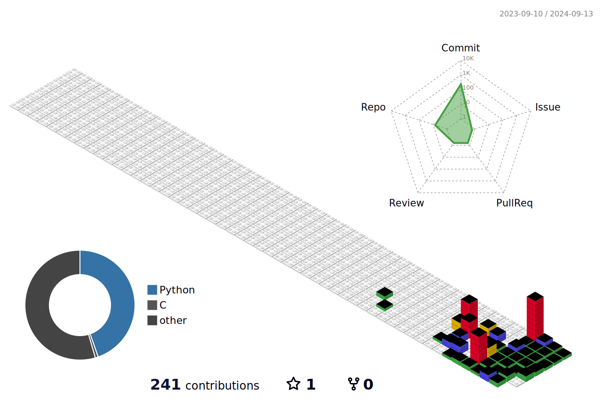

 
 
### 🛠 &nbsp;Tech Stack
A8B9CC

  <code></code>
  <code></code>
  <code></code>
  <code></code>
  <code></code>
  <code></code>
  <code></code>

  <code></code>
  <code></code>
  <code></code>
  <code></code>

  <code></code>
  <code></code>
  <code></code>
  <code></code>
  <code></code>
  <code></code>

  <code></code>
  <code></code>
  <code></code>
  <code></code>

 

 
 
 

  

  

  
  

 

<!--
**hi-rice/hi-rice** is a ✨ _special_ ✨ repository because its `README.md` (this file) appears on your GitHub profile.

Here are some ideas to get you started:

- 🔭 I’m currently working on ...
- 🌱 I’m currently learning ...
- 👯 I’m looking to collaborate on ...
- 🤔 I’m looking for help with ...
- 💬 Ask me about ...
- 📫 How to reach me: ...
- 😄 Pronouns: ...
- ⚡ Fun fact: ...
-->
 

 

